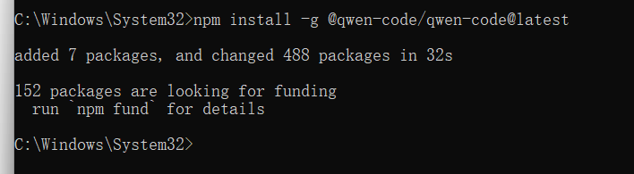
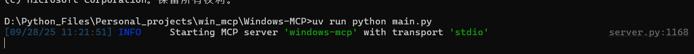

<<<<<<< HEAD
# Windows_mcp三步快速部署

下载node.js

```
https://nodejs.org/dist/v24.9.0/node-v24.9.0-x64.msi
```

python 3.13.7

```
https://www.python.org/ftp/python/3.13.7/python-3.13.7-amd64.exe
```

### 第一步:使用node.js的控制台下载相关包

```
npm install -g @qwen-code/qwen-code@latest
```


下载成功



## 第二步：在项目位置clone项目

```
git clone https://github.com/CursorTouch/Windows-MCP.git

cd Windows-MCP
```

在项目中，使用uv指令，安装依赖(大约有100个包，需要一定时间)

```
uv sync
```


## 第三步：配置环境

打开路径，%USERPROFILE%/.qwen/settings.json

```
win+R，
运行%USERPROFILE%，
查找下级目录：/.qwen
```

如果没有.qwen文件夹，则创建，并在其中创建settings.json文件，其中内容为：

```json
{
//MCP Server Config
  "mcpServers": {
    "windows-mcp": {
      "command": "uv",
      "args": [
        "--directory",
        "<path to the windows-mcp directory>",
        "run",
        "main.py"
      ]
    }
  }
}
```

依赖包安装完成后，启动mcp服务，建议使用管理员身份

```
uv run python main.py
```




在cmd中运行qwen


# 现在就可以开始使用啦~

=======
# WindowsMCP_Instruction_Manual
Just three steps, teach you how to easily deploy Windows MCP services locally
>>>>>>> 5c4d2977402d073bdb07381e12f14fd31b247132
